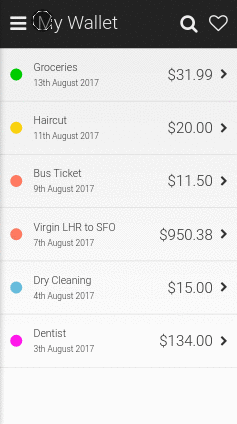

# SuperSlide.js


A lightweight, configurable sliding menu for your next PWA with promises. Only 2k gzipped!



This library aims to provide a highly configurable, ready-to-use sliding menu for your next web application, while delivering native-like animation performance. It was created by the [OSREC Technologies](https://`OSREC.co.uk) while developing [Bx, our invoicing, time-tracking and project management PWA](https://usebx.com).

# Installation

```
npm install superslide.js
```

# Usage

Reference the library in a script tag
```html
<script src='superslide.js'></script>
```
Add basic HTML markup
```html
<body>
  <div id='content'>Content</div>
  <div id='menu'>Menu</div>
</body>
```
Add styles (so we can see what's going on!)
```html
<style>
  body     { padding: 0px; margin: 0px; }
  #menu    { background: #ccc; }
  #content { min-height: 100vh; min-width: 100vw; }
</style>
```
Initialise the menu
```js
var myMenu = new OSREC.superslide
({
    slider: document.getElementById('menu'),
    content: document.getElementById('content'),
    animation: 'slideLeft'
});

// Promise resolves once menu is open
var openPromise = myMenu.open();
```

**[Try the demo here](https://osrec.github.io/SuperSlide.js/demo.html)**

# Animations

Standard Version has 4 animation options available:

| slideLeft | slideRight | slideBottom | slideTop |
|--|--|--|--|
||||

#### PRO version :star: contains many more menu animations (check it out @ https://osrec.co.uk/products/superslidejs)

# Parameters

- `animation` (`string`): Any of the animations in the animation library (`slideLeft`, `slideRight`, `slideTop`, `slideBottom`).

- `duration` (`integer`):
Duration in seconds for the slide animation

- `allowDrag` (`boolean`):
Allow the menu to be dragged into the open or closed position via touch events.

- `slideContent` (`boolean`):
Slide the content along with the menu

- `allowContentInteraction` (`boolean`):
Allow the content to be clicked or scrolled while the menu is open

- `closeOnBlur` (`boolean`):
Close the menu when the user clicks or taps anywhere outside the menu

- `width` (`string`):
The width of the menu (for menus that sit along a vertical edge). Examples: '60vw' or '300px' or '80%'

- `height` (`string`):
The height of the menu (for menus that sit along a horizontal edge). Examples: '50vh' or '300px' or '80%'

- `dragThreshold` (`integer`):
The number of pixels from the edge from where a user can begin dragging; example: 70. Use with the allowDrag option.

- `openThreshold` (`integer`):
When the menu is in the open position, the number of pixels it must be dragged before it opens automatically; example: 30. Use with the allowDrag option.

- `closeThreshold` (`integer`):
When the menu is in the closed position, the number of pixels it must be dragged before it closes automatically; example: 20. Use with the allowDrag option.

- `beforeOpen` (`callback`):
Executed before the menu begins to open

- `onOpen` (`callback`):
Executed straight after the menu has opened

- `beforeClose` (`callback`):
Executed before the menu begins to close

- `onClose` (`callback`):
Executed as soon as the menu has closed

- `onDrag` (`completion`, `callback`):
Executed as the menu is being dragged; returns percentage completion

# Methods

- `OSREC.superslide.open()`
Open the menu.
Returns a promise that resolves once the menu opens (i.e. animation completes).

- `OSREC.superslide.close()`
Close the menu.
Returns a promise that resolves once the menu closes (i.e. animation completes).

- `OSREC.superslide.toggle()`
Toggles the menu.
Returns a promise that resolves once the menu has been toggled (i.e. animation completes).

- `OSREC.superslide.isOpen()`
True if the menu is open, false if closed. The last state if mid-drag.
Returns a boolean.

- `OSREC.superslide.ready()`
Check if the menu is fully initialised.
Returns a promise that resolves when fully initialised.

- `OSREC.superslide.destroy()`
Destroy the menu. This will close the menu if it is open before destroying.
Returns null

# Credits

Created by the [Bx team](https://usebx.com) at [OSREC Technologies](https://osrec.co.uk).


The library was developed as part of our business and project management app called Bx ([you can check it out here](https://usebx.com)).
